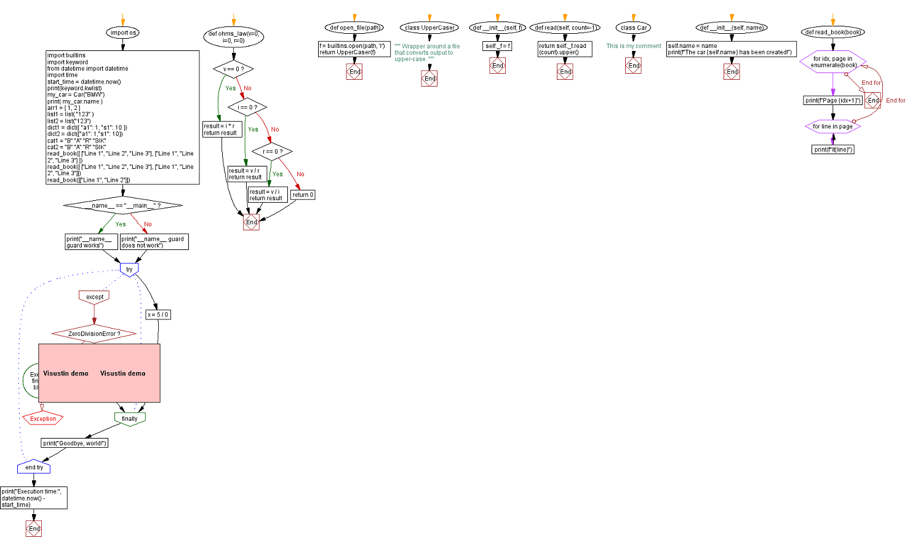
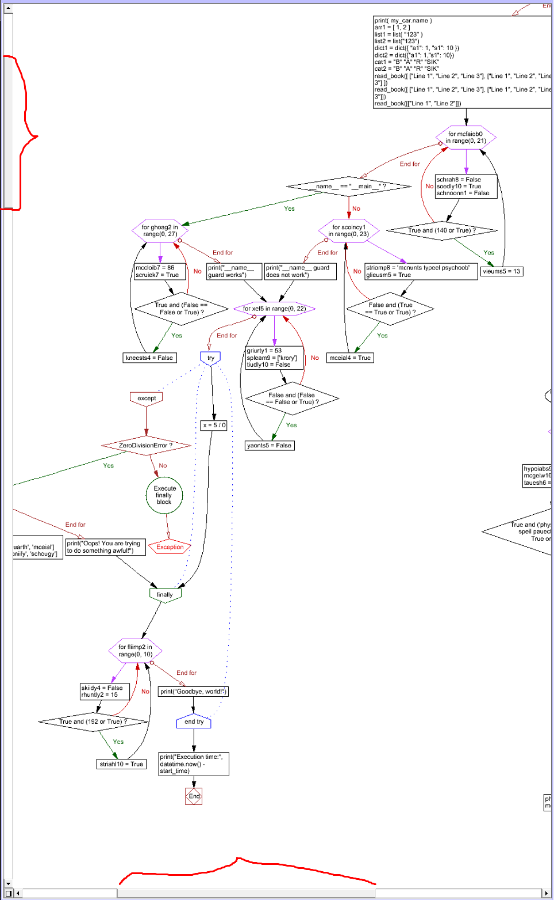
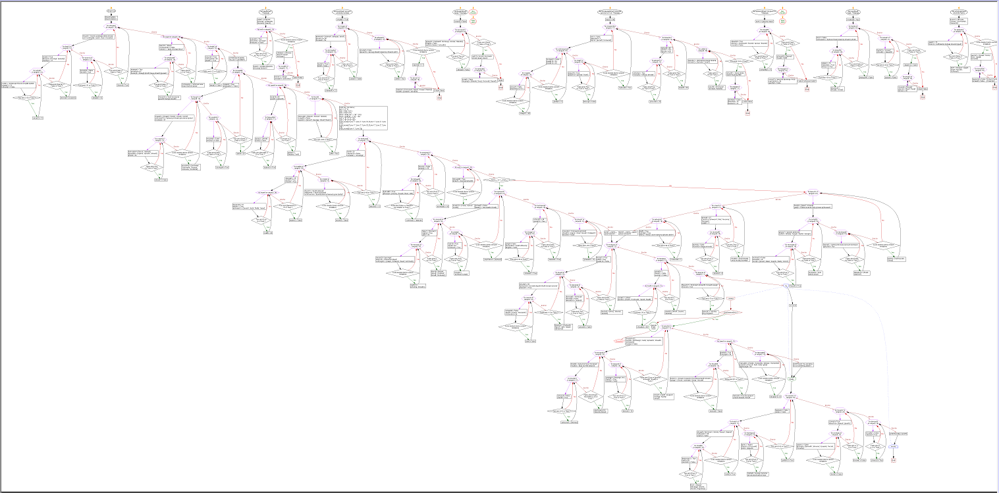

# ObfuscatePyViaPy
> Python obfuscator for Python files

This simple code takes .py source file and makes .py obfuscated via adding fake data to your code.

## Available fake data
It can generate fake:
- `functions` with fake args and body
- `classes` with functions
- `loops` with fake body
- `if-blocks` with fake body
- `variables` with fake values

## Usage
```Python3
from CodeInserter import CodeInserter

# Read file
file = open("input-filename.py", "r")
read_lines = file.readlines()

# Process
code_inserter = CodeInserter(file_lines=read_lines, iterations=2)
code_inserter.start()

# Output
code_inserter.save_to_file("output-filename.py")
```

`iterations` value shows the number of times your code has been processed

## Performance
Tests on **anything.py** input file.

| Iterations   | Size     | Rows      | Execution time        |
|--------------|----------|-----------|-----------------------|
| None (input) | 2 KB     | 113       | 0:00:00               |
| 1            | 10 KB    | 294       | 0:00:00               |
| 2            | 33 KB    | 879       | 0:00:00.001999        |
| 3            | 94 KB    | 2 418     | 0:00:00.027001        |
| 5            | 655 KB   | 16 048    | 0:00:10.539556        |
| 10           | 55,93 MB | 1 220 996 | I don't want even try |

## Code visualization
I use Visustin v8 Demo for building visual diagrams.

### Input file


### 1 iterations
Each iteration adds some code. For example:


### 3 iterations
Just to show the structure:


## An exception
If a file does not contain blocks like: `print`, `def`, 
`if`, `try`, `class` it won't work. For example 
file **pelicanconf.py** contains only variables, so 
I don't think it necessary to modify this type of files.